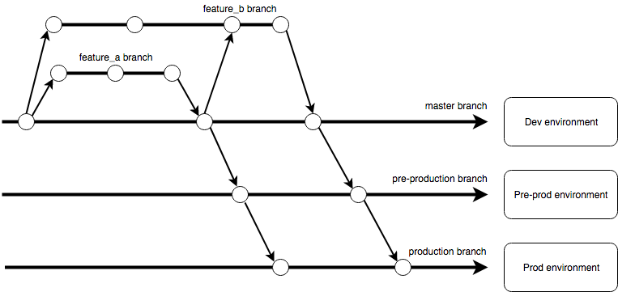

# DevOps for small / medium web apps - Part 4 - Continuous Delivery

## Summary
0. [Introduction](#introduction)
1. [Highly available architecture](#highly-available-architecture)
2. [GitLab flow](#gitlab-flow)
3. Infrastructure-as-code with Terraform
4. Pipeline improvements
   
## Introduction
In this part we will finally deploy our application in the cloud!

We will create 3 environments:
* dev.my-sample-domain.xyz - The "development" environment with the latest features.
* pre-prod.my-sample-domain.xyz - The "pre-production" environment for testing.
* www.my-sample-domain.xyz - The "production" environment for all users.

The two first sections are quite theoretical as they deal with cloud infrastructure design and development & deployment
process.

The section after that introduces [Terraform](https://www.terraform.io/): as you can see in the previous parts of this
tutorial, creating our environment for GitLab and SonarQube with
the [web console](https://home-intl.console.aliyun.com/) is quite slow. Since we will have to create 3 nearly
identical environments, we will use Terraform to speed-up the process.

The final step is to improve our GitLab pipeline in order to make everything automatic.

## Highly available architecture
The goal is to be able to serve our web application to users even in case of hardware or network failure.

The following diagram shows a simplified view of our architecture:

As you can see we are duplicating each cloud resource into two availability zones (zone A and zone B): since these zones
are independents, a problem in one zone (e.g. machine/network failure) does not affect the other one.

Our application will run on two ECS instances. The traffic from internet is redirected thanks to a server load balancer
installed in front of them. As you can see our system uses HTTPS externally and HTTP internally.

For the data storage layer we use [ApsaraDB RDS for MySQL](https://www.alibabacloud.com/product/apsaradb-for-rds-mysql),
a managed database service that handles server installation, maintenance, automatic backup, ...etc.

Note: with this diagram you can understand why a stateless application is important: the only place where data can be
shared is the database, so we don't need to establish a direct link between the applications. Moreover, if two users
are modifying the same data (e.g. by deleting the same item), the database will handle transactions for us, keep
the data consistent and reject one user modification.

## GitLab flow
Until now our development workflow was very simple: modify some source code, commit it into the master branch and push
it to GitLab. This is fine at the beginning (single developer, no deployed version), but we need to enrich this process
in order to properly manage our releases. For that [GitLab Flow](https://docs.gitlab.com/ee/workflow/gitlab_flow.html)
is a good solution: simple but rich enough for our needs.

The following diagram illustrates how we will use GitLab Flow in this tutorial:

The long horizontal arrows corresponds to long-lived branches (master, pre-production and production), a circle
represents a commit, and the timeline goes from the left to the right (a commit on the left is older than a commit on
the right).

The two short horizontal branches on the top correspond to short-lived branches: they are used to implement new features
or bug fixes. In this example, two developers work on two features in parallel ("feature_a" and "feature_b"). When
the "feature_a" is finished, the developer emits
a [merge request](https://docs.gitlab.com/ee/user/project/merge_requests/) from his branch to the master. This is
usually a good time for [code review](https://en.wikipedia.org/wiki/Code_review): another developer can check the
modifications and accept / reject the request. If accepted, the feature branch is merged into the master and closed.
In this example, the developer on the "feature_b" merges the new commit from the master branch corresponding to the
"feature_a" to his own branch. He later can emit a merge request to merge his branch to the master.

On the right, the blocks correspond to environments (one environment = an EIP, a server load balancer, two ECS instances
and a RDS instance). Everytime a commit is done in the master branch, the CI / CD pipeline compiles, tests, analyzes
the code, updates the database schema and installs the new application version on the ECS instances. The process is the
same with the pre-production and production branches: it allows us to manage releases by emitting a merge request
from the master branch to the pre-production one and from the pre-production one to the production one.