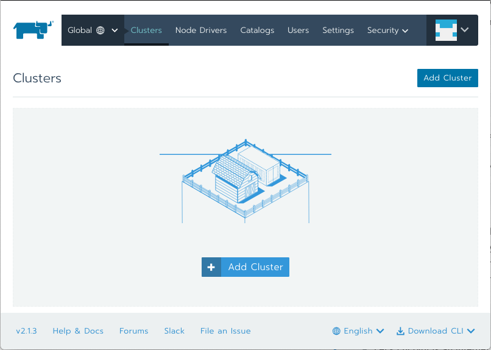

# Getting started with Rancher

## Summary
0. [Introduction](#introduction)
1. [Prerequisite](#prerequisite)
2. [Rancher installation](#rancher-installation)

## Introduction
[Rancher](https://rancher.com/) is a multi-cluster [Kubernetes](https://kubernetes.io) management platform. The goal
of this tutorial is to explain how to setup Rancher on a
[single node](https://rancher.com/docs/rancher/v2.x/en/installation/) and how to integrate it with
[Alibaba Cloud Container Service](https://www.alibabacloud.com/product/container-service).

## Prerequisite
In order to follow this tutorial, you need to 
[create an Alibaba Cloud account](https://www.alibabacloud.com/help/doc-detail/50482.htm) and
[obtain an access key id and secret](https://www.alibabacloud.com/help/faq-detail/63482.htm).

Cloud resources are created with [Terraform](https://www.terraform.io/) scripts. If you don't know this tool, please
[follow this tutorial](https://www.terraform.io/intro/getting-started/install.html) and familiarize yourself with the
[alicloud provider](https://www.terraform.io/docs/providers/alicloud/index.html).

Please also make sure you are familiarized with Kubernetes. If you need, you can follow
this [tutorial](https://kubernetes.io/docs/tutorials/kubernetes-basics/) to learn the basics. You will also need
to [setup the command line tool 'kubectl'](https://kubernetes.io/docs/tasks/tools/install-kubectl/).

Important: please download the 
[related resources](https://github.com/alibabacloud-howto/devops/tree/master/tutorials/getting_started_with_rancher)
before moving to the next section.

## Rancher installation
There are two ways to [setup](https://rancher.com/docs/rancher/v2.x/en/installation/) Rancher:
* Single-node configuration;
* High-Availability configuration.

We will choose the first way as it makes things simpler.

Open a terminal on your computer and execute the following instructions:
```bash
# Go to the folder where you have downloaded this tutorial
cd path/to/this/tutorial

# Go to the Rancher environment folder
cd environment/rancher

# Download the latest stable version of the Alibaba Cloud provider
terraform init

# Configure the Alibaba Cloud provider
export ALICLOUD_ACCESS_KEY="your-accesskey-id"
export ALICLOUD_SECRET_KEY="your-accesskey-secret"
export ALICLOUD_REGION="your-region-id"

# Configure variables for the Terraform scripts
export TF_VAR_ecs_root_password="your-root-password"

# Create the resources in the cloud
terraform apply
```
The last command should ask you to confirm by entering "yes" and should end with similar logs:
```
Apply complete! Resources: 9 added, 0 changed, 0 destroyed.

Outputs:

rancher_eip_ip_address = 47.74.156.72
```
Open a web browser tab and enter the URL corresponding to https://<rancher_eip_ip_address> 
(e.g. https://47.74.156.72/). Your web browser will complain that the connection is unsecured (which is normal
because we didn't configure any SSL/TLS certificate); just add an exception and continue browsing.

Note: if using an invalid certificate bothers you, please follow
[this documentation](https://rancher.com/docs/rancher/v2.x/en/installation/single-node/#2-choose-an-ssl-option-and-install-rancher)
to setup HTTPS properly.

You should get a page like this:


Set an administrator password and click on the "Continue" button. The next step asks you to configure the server URL,
just keep the default value and click on "Save URL".

You should see the clusters page:

